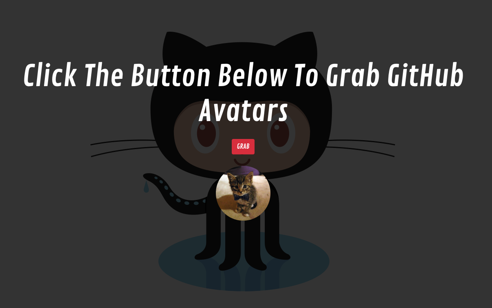

# Project

 

Create an application that displays the avatar of public GitHub repository owners.

For owners with logins that start with a or A, display a list of the repository owner’s followers when a user hovers over the avatar image.

*Requirements:*
* Use a Node service API to query the GitHub repositories API.✅
* Do not query GitHub repositories API directly from the client application.✅
* Do not return unnecessary data to the client application.✅
* Use React as the client framework.✅
* Use Bootstrap for UI components.✅
* Start with repository 1000.✅
* Try to fit as many avatars on one screen as possible. (i.e. Without scrolling.)🚫
* The application should run on localhost with the “npm start” command.✅

*Bonus Features:*
* Display a detail view of the repository owner when a user clicks on an avatar.🚫
* Add a filter to show only certain avatars based on whatever criteria you come up with.🚫
* Minimize calls to the GitHub API to avoid rate limiting.🚫

## Run Application
```sh
$ cd $REPO_ROOT
$ npm install
$ npm start
```
## Personal Notes
* Green check box emojis ✅ represent items completed. Red prohibited emojis 🚫 have yet to be completed. 
* For the backend I've tried applying promises using `async/await` and `for await...of` in order to compile the names of the followers. Unfortunatly I am not having any luck and the response is being sent without `followers ` information.
* On the frontend I am still figuring out how to dynamically add images.